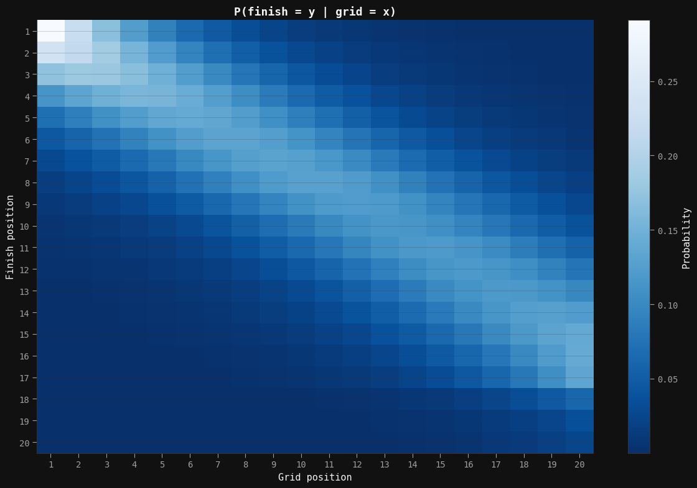

F1 is all about speed, strategy, and skill. You need to be fast, need to be smart, and need to be consistent. However, there are ways to influence your chances of winning before the lights go out. Some comes in the form of pre-race strategy planning, some in the form of upgrades to the car. However, one of the most important ways to do this is by getting the best spot on the grid before the race even starts. Qualifying is a critical part of the F1 weekend, and in some races is the most important part of the weekend. It is what sets the grid for each and every driver, giving them an advantage or disadvantage before they even start the race.

This advantage that we talk about is always in loose terms. We know that a driver on the front row is gonna have some sort of edge over the driver behind them, but how much of an advantage is it really? Is it worth wasting resources such as tyres or engine performance to get an extra jump at the start? Most importantly, how can we quantify this advantage in a way that means something to drivers and teams alike?. That is the topic I decided to explore as a part of my [Bayesian Analysis](https://www.coursera.org/specializations/bayesian-statistics) specialization. As a part of the capstone project for our Techniques and Models course, I wrote a paper on analyzing the probability of getting a certain position given you start in a specific grid slot. This blog is meant to act as a more casual look at using Bayesian methods for a sport specific problem, and a preview of the final paper I created.

## Why Bayesian Analysis?

Aside from the fact that I was doing this project as a part of my course, Bayesian Analysis offers a few benefits over traditional modelling and frequentist statistics. The number one benefit that anyone who is familiar with bayesian is that it allows us to quantify uncertainty in a way that is more understandable in a real world context. Rather than giving us an absolute value to use in our model, our output gives us a range of values as a probability distribution that we can then use to help us understand our error in our model fit.

Bayesian is a great fit for analyzing problems in sports due to the fact that sports in their essence are not deterministic, and many factors can influence the outcome. In F1 specifically, a driver who may start in first may be more likely to come in first at the end of the race, but that doesn't prevent safety cars, engine failures, or even rain.
In our problem of predicting race outcomes using grid probabilities, we want to not only figure out a probability for finishing in a specific position, but also in finishing in a range of positions. With the help of Bayesian methods, we can effectively simulate multiple races to help produce a best fit for probabilities of finishing in a specific position.

## Getting the Data

To first do a data analysis project, we need to get the data. Luckily for us, F1 data is not hard to get access to. There are a couple API's available online, but we are going to use [FastF1](https://docs.fastf1.dev/), a Python package for downloading F1 race and telemetry data. For our project, we will need the following data from each race

- The Driver's Grid Position
- The Driver's Classified Positions
- The Year and Circuit

To make this easy to work with, and for future proofing, we decided to use data from 2018-2025. This not only gives us data in two different eras for us to explore, but also gives us the ability to add telemetry data for exploration.

## A Basic Model

First lets determine at the most basic level what the grid position advantage is. In this model we are only going to use one explanatory variable, the grid position, to predict the final classified position. Since positions are discrete, we will use an ordered logistic regression model to predict the probability of finishing in a specific position.

An ordered logistic model is essentially a logistic model combined with a categorical distribution. In this method, we have a number of cutpoints which we use as fences to determine which position a person finishes in. We then use a logistic model to figure out the probability of a position being behind that fence. This allows the model to also make a prediction and improve itself over multiple iterations. We can see the hierarchical model below.

$$
\begin{aligned}
    \text{ClassifiedPosition}_i &\sim \text{OrderedLogistic}(\eta_i, c) \\
    \eta_i &= \beta \cdot \text{GridPositionNormalized}_i \\
    \beta &\sim \text{Normal}(0, 5) \\
    \text{GridPositionNormalized}_i &= \frac{\text{GridPosition}_i - \bar{\text{GridPosition}}}{\sigma(\text{GridPosition})} \\
    c_k &\sim \text{Normal}(\mu_k, 1.5) \text{ for } k = 0, 1, ..., K - 1 \\
    \mu_k &= -2 + \frac{4k}{K-1}, \quad k=0,1,\dots,K-1
\end{aligned}
$$

As you can see above we also did some normalization to our grid position variable to remove the uninterpretable intercept we would otherwise have. 

### Model Results

After running our model, we created not only validation checks, but also a dataset mapping grid position to the probability of finishing in a specific position. To get a clear idea as to whats happening, lets view this as a heatmap.

As you can see from this heatmap, there is a clear relationship between grid position and finishing position, with the lighter colours representing a higher probability of finishing in that position. The trend is diagonal down to 20, but not perfectly diagonal. What we notice is that the probabilities get weaker in the midfield, and then stronger in the backmarkers. This is explained in two separate but related ways.

The midfield is where most of the battles are going to take place because you have more cars in front and in back. This means that as battles are happening around you, your probability is influenced. For example, a battle between two cars behind you may cause them to slow down, increasing their gap to you. This means you have a better chance of staying in your current positiokn as the back cars need to make up that time.

The backmarkers on the other hand are have their probability influenced by non race factors. For example, if a car in front has to retire, you essentially get a free position gain. This is why you see a lower probability of the 20th car finishing 20th than 17th. It is not common for a race to finish with all 20 drivers finishing; there is almost always at least one DNF. In our data we removed these DNF's as they are not representative of the problem we are trying to solve here. 

## Extending the Model

In our paper we actually built 3 models: our basic one, one with the track type as a variable and one with the regulation era as a variable. While we won't go into too much detail on these models, lets at least talk about them and why we think they might be important. 

In F1 we see two types of tracks: conventional and street. Conventional, also known as purpose built or permanent tracks, are tracks built for the explicit purpose of racing. This design choice means that the tracks have different characteristics that influence racing. These tracks tend to be designed for high speed and better cornering, and feature wider roads and long straights. Street circuits on the other hand are just circuits that use existing infrastructure to race on. Since they were made with regular driving in mind and not high speed racing, they are skinnier, have tighter corners, and their surface may not be ideal for our tyre compounds. These reasons alone imply that racing on street circuits is not only more difficult, but more static as well with less movement. This means we should probably see a stronger relationship between grid and classified position, where the probability is concenrtrated more on the diagonal and less spread out.

Regulation eras are also important to consider as they are most often designed to address problems in the previous era while also improving the racing quality. From 2018-2021, we had the turbo hybrid era, an era dominated by Mercedes and Lewis Hamilton. This era was criticized for being too static, with the same drivers winning every race, leading to the classic HAM-BOT-VER meme. In 2022, the FIA introduced the second Ground Effect era of regulations, with a focus on aerodynamics over engine performance. The goal of these regualtions was to improve the racing quality by allowing cars to follow closer and handle better in dirty air (turbulent air coming off the car in front). If the regulations were successful, we should see more variablity in the relationship between grid and classified position, with more probability spread out and less concentrated on the diagonal.

## What's Next 

This model was not only my first attempt at bayesian analysis, it was also my first step in building more research on F1. Is the model perfect? Absolutely not. However, it is a great starting point for building not only new models but larger models with this as a component. Imagine a win probability model that allows us to use practice data to help predict final race outcomes. 

If you want to go more in depth on this topic, I encourage you to check out the final paper I wrote on this subject in my [Projects Section](/projects?project=grid-position)
